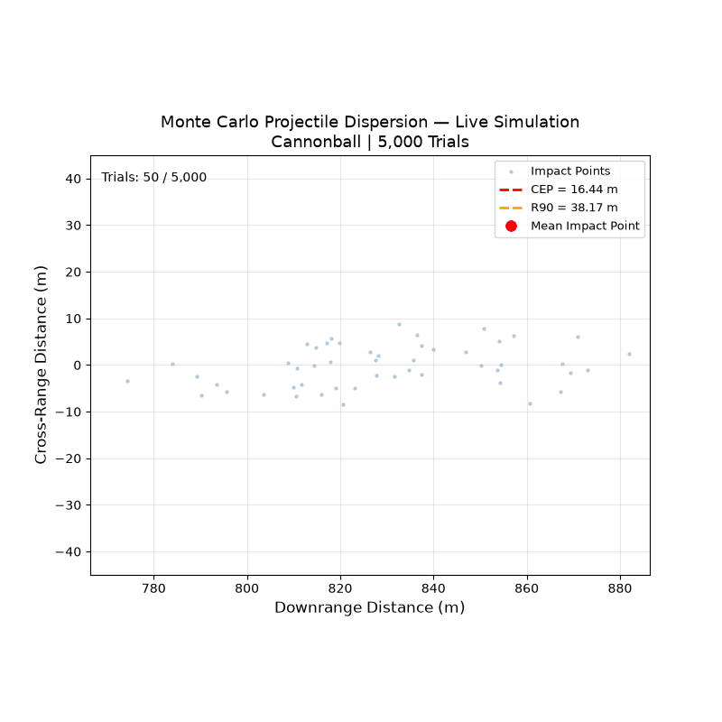
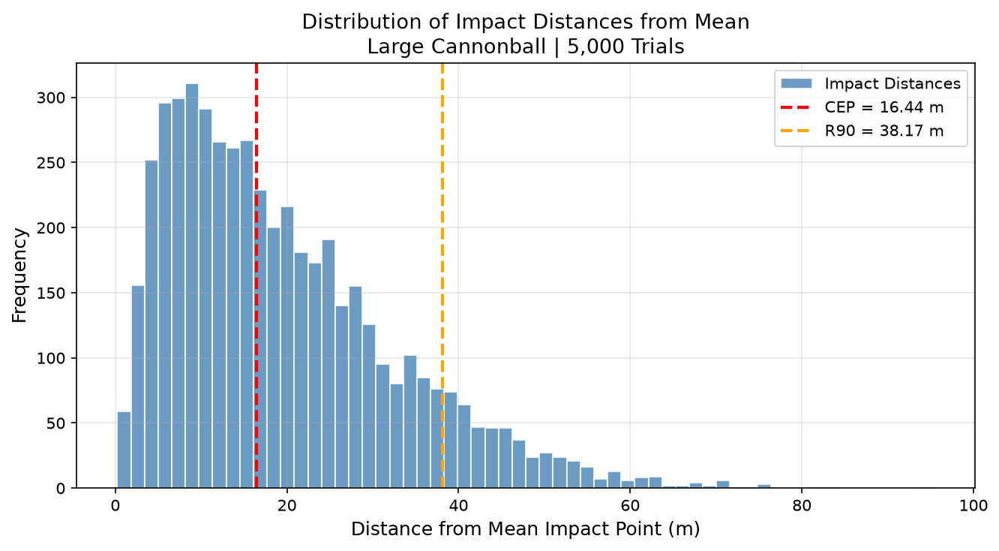

# Monte Carlo CEP Analysis

A physics-based Monte Carlo simulation that models the statistical 
dispersion of cannonball impacts under realistic launch uncertainty. 
This project calculates the Circular Error Probable (CEP), which is a standard 
metric in defense and ballistic systems analysis used to quantify the 
accuracy of a weapons system.



---

## What is CEP?

Circular Error Probable is the radius around a mean impact point within 
which 50% of projectiles are expected to land. It is a standard metric 
used in defense, ballistics, and weapons systems analysis to characterize 
the accuracy of a system under realistic operating conditions. A 
complementary metric, R90, describes the radius within which 90% of 
projectiles land.

---

## Motivation

In real-world ballistic systems, no two launches are identical. Small 
variations in launch angle, muzzle velocity, wind conditions, and lateral 
dispersion sources mean that projectiles do not always land in the same 
location. Rather than modeling a single deterministic trajectory, this 
simulation embraces that uncertainty by running 5,000 individual launches, 
each with slightly randomized parameters sampled from realistic probability 
distributions. The resulting distribution of impact points is then analyzed 
statistically to compute CEP and R90.

---

## Physics Model

The simulation solves a system of four coupled first-order ODEs representing 
2D projectile motion with quadratic aerodynamic drag and horizontal wind:

- $\frac{dx}{dt} = vx$

- $\frac{dy}{dt} = vy$
 
- $\frac{dvx}{dt} = -(C/M) * v * v_{xrel}$

- $\frac{dvy}{dt} = -G - (C/M) * v_{rel} * v_y$

Where $v_{rel}$ is the projectile's speed relative to the air accounting for 
wind. Integration is performed using `scipy.solve_ivp` with an event 
function that terminates at ground impact (y = 0).

Cross-range dispersion, lateral scatter perpendicular to the flight path, 
is modeled as a normally distributed offset representing lateral wind 
components and other factors not captured in a 2D flight model.

---

## Projectile Properties

| Property       | Value       |
|----------------|-------------|
| Projectile     | Cannonball  |
| Mass           | 14.51 kg    |
| Drag Constant  | 0.00443 kg/m|

## Uncertainty Sources

| Parameter         | Nominal Value | Std Dev  |
|-------------------|---------------|----------|
| Launch Angle      | 45.0°         | ±0.5°    |
| Muzzle Velocity   | 100.0 m/s     | ±1.5 m/s |
| Wind Speed        | 0.0 m/s       | ±3.0 m/s |
| Cross-Range       | 0.0 m         | ±5.0 m   |

## Results



| Metric                  | Value      |
|-------------------------|------------|
| Trials Completed        | 5,000      |
| Mean Impact Distance    | 826.39 m   |
| Std Dev (Downrange)     | 22.90 m    |
| Std Dev (Cross-Range)   | 5.02 m     |
| CEP                     | 16.44 m    |
| R90                     | 38.17 m    |

---

## Real-World Applications

Monte Carlo methods are widely used in defense and aerospace engineering 
for ballistic trajectory analysis, missile accuracy assessment, satellite 
launch trajectory planning, and nuclear hardness and survivability analysis. 
CEP specifically is a standard performance metric used by organizations 
like the Department of Defense and defense contractors to evaluate and 
compare weapons systems accuracy.

---

## Getting Started

**Prerequisites**
- Python 3.8 or higher
- Jupyter Notebook, JupyterLab, or VS Code

---

**Installation**

```bash
pip install -r requirements.txt
```

---

**Running the Simulation**
1. Open `MonteCarloCEP.ipynb` in Jupyter Notebook
2. Run all cells in order
3. Note: The Monte Carlo loop runs 5,000 trials and takes 
   approximately 1-2 minutes to complete

---

## Author
Zachary Lee
