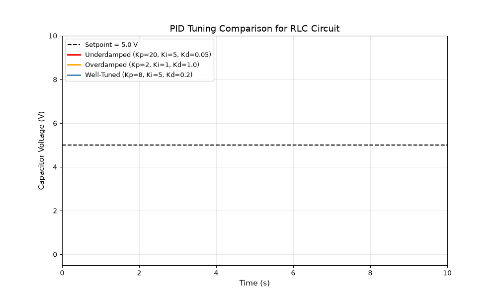
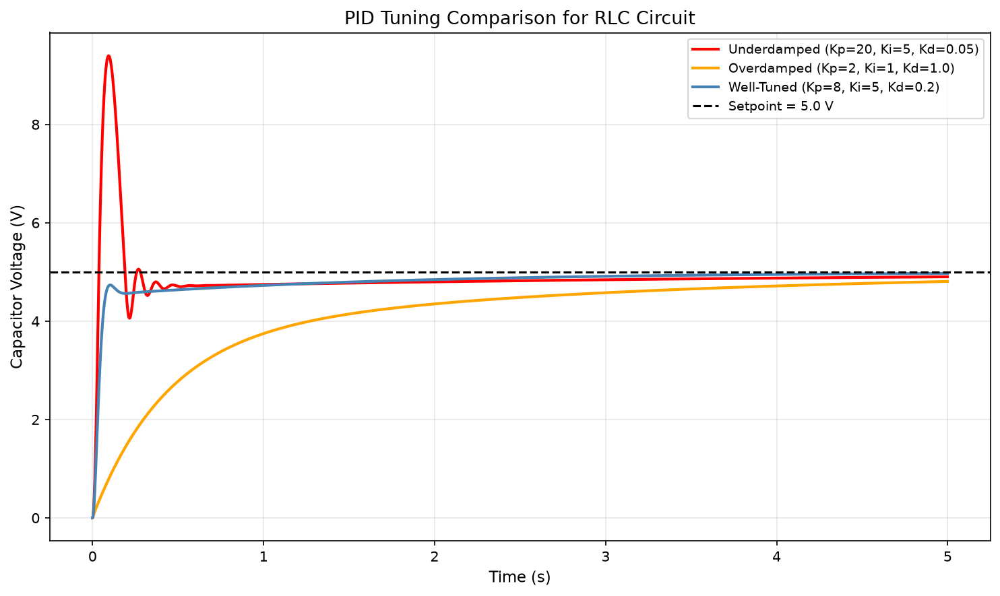
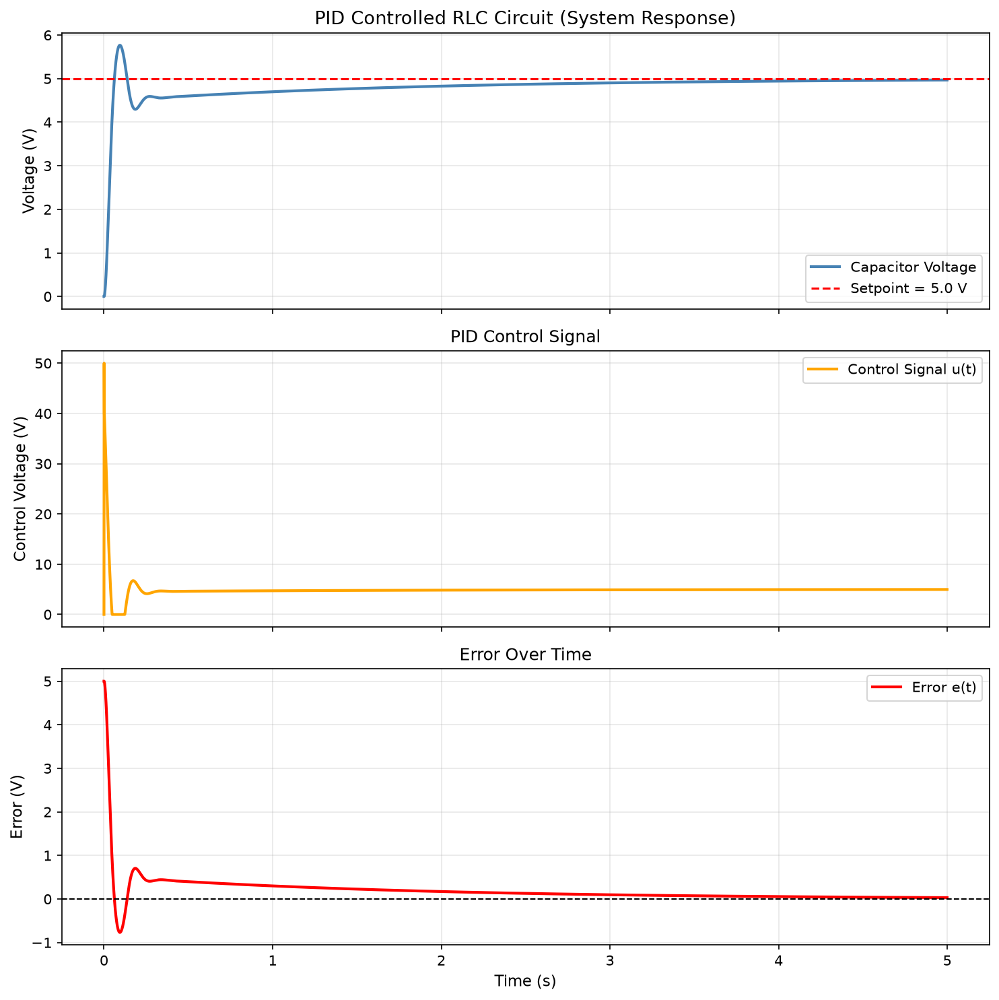

# PID Controller for RLC Circuit Simulation

A discrete-time PID controller implementation that regulates the capacitor voltage of a series RLC circuit toward a target setpoint. 
This project models the governing circuit dynamics from first principles using Kirchhoff's Loop Laws, then designs and tunes a feedback controller to drive the system to a desired state, demonstrating the same control theory principles used in electrical, systems, and test engineering applications.



## Project Motivation

A PID controller is one of the most widely used feedback control mechanisms in engineering, applied across electrical systems, aerospace guidance, industrial automation, and robotics. This project demonstrates the mathematical equivalence between a series RLC circuit and a mass-spring system, both governed by the same second-order differential equation structure, and shows how a single control framework can be applied across fundamentally different physical systems.

## Physics and Control Theory

The RLC circuit's governing equation is derived from Kirchhoff's 
Voltage Law:

$$ L\ddot{q} + R\dot{q} + \frac{1}{C}q = V(t) $$

where $V(t)$ is the voltage signal supplied by the PID controller. The controller continuously measures the error between the target voltage and the actual capacitor voltage, then computes a corrective signal using the standard PID control law:

$$ u(t) = K_{p}e(t) + K_{i}\int_{0}^{t}e(\tau)d\tau + 
K_{d}\frac{de(t)}{dt} $$

Full derivations including Kirchhoff's Current and Voltage Laws and the numerical implementation of the PID control law are available in 

[Physics_Background.md](docs/Physics_Background.md).

## Features

- RLC circuit simulation using Euler integration.
- Discrete-time PID controller with configurable gains.
- Control signal clamping to simulate realistic actuator limits.
- Comparative analysis across three tuning regimes: underdamped, overdamped, and well-tuned.
- Automated settling time detection using a sustained-tolerance window.
- Animated visualization of controller performance across tuning scenarios.  

## Tuning Comparison

| Scenario     | Kp   | Ki  | Kd   | Behavior                          |
|--------------|------|-----|------|-----------------------------------|
| Underdamped  | 20.0 | 5.0 | 0.05 | Fast but oscillates before settling |
| Overdamped   | 2.0  | 1.0 | 1.0  | Slow, no overshoot                |
| Well-Tuned   | 8.0  | 5.0 | 0.2  | Fast response, minimal overshoot  |



The well-tuned configuration reaches a sustained equilibrium 
significantly faster than either the underdamped or overdamped 
configurations, demonstrating the practical impact of proper 
PID tuning on system performance.

## System Response



## Getting Started

**Prerequisites**
- Python 3.8 or higher
- Jupyter Notebook or JupyterLab

**Installation**

```python
pip install -r requirements.txt
```

**Running the Simulation**
1. Open `notebooks/PIDControllerSystems.ipynb` in Jupyter Notebook
2. Run all cells in order
3. Adjust `Kp`, `Ki`, and `Kd` in the constants cell to explore 
   different tuning behaviors

## Author
Zachary Lee
