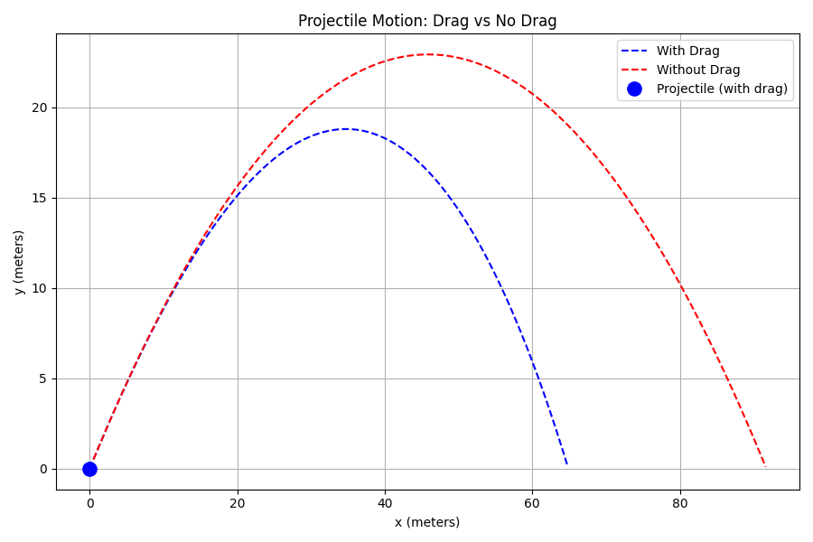
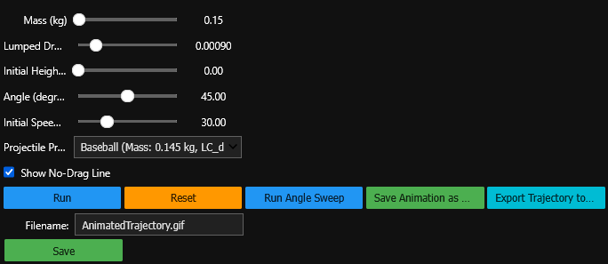
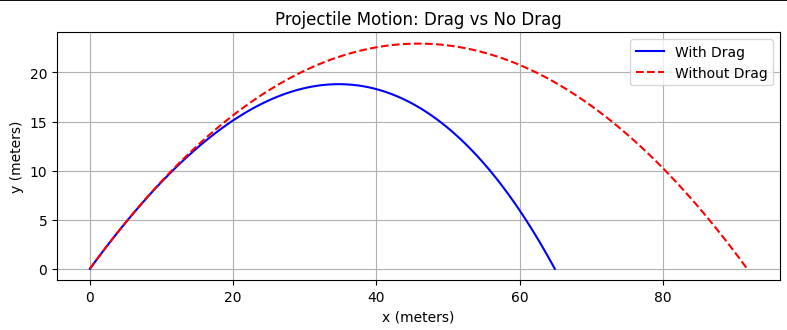
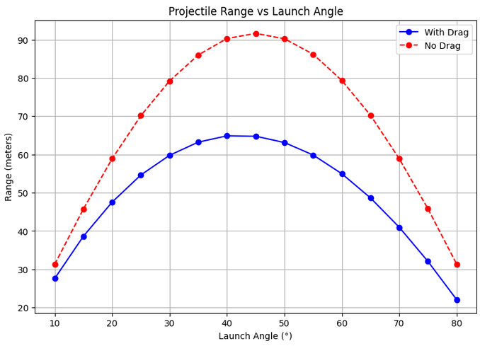

## 2D Projectile Motion With Drag
An Interactive Physics Simulation by Zachary Lee

## Overview
This project is an interactive physics simulation that models 2D projectile motion both with and without quadratic drag, using numerical integration via SciPy’s solve_ivp.
It combines:

- Classical kinematics
- Fluid dynamics (drag force modeling)
- Numerical ODE solving
- Interactive widgets
- Animated trajectory visualization

My goal with this project is twofold:

- Derive and explain the physics behind projectile motion, including drag.
- Use the derived equations to accurately simulate real‑world projectile trajectories.

## Physics Background
Kinematics Derivations
The notebook walks through the derivation of the four classical kinematic equations:

- $v = v_0 + at$
- $\Delta{x} = \frac{1}{2}(v_0 + v)t$
- $\Delta{x} = v_0t + \frac{1}{2}a{t^2}$
- ${v^2} = {v_0^2} + 2a\Delta{x}$

These equations describe motion under constant acceleration, which applies to projectile motion without drag.

## Modeling Drag
Real projectiles experience drag, which makes acceleration velocity‑dependent.
The simulaton covers:

- Linear Drag: $F_d = -bv$
- Quadratic Drag: $F_d = -cv^2$
- Mixed Drag: $F_d = -bv -cv^2$

For this project, quadratic drag is used, as it best models objects like baseballs, arrows, and other fast-moving projectiles.

The drag force is derived from Bernoulli’s equation:

$$F_d = \frac{1}{2}\rho{C_d}A{v^2}$$

This is simplified using a lumped drag constant:

$$c = \frac{1}{2}\rho{C_d}A$$

The resulting acceleration components are:

$$a_x = -\frac{c}{m}v{v_x}$$

$$a_y = -g -\frac{c}{m}v{v_y}$$

These equations are numerically integrated using SciPy.

## Numerical Integration
The simulation uses:

python
scipy.integrate.solve_ivp

This provides:

- High accuracy
- Adaptive step sizing
- Event detection (stops when projectile hits the ground)
- Better stability than Euler or RK2 methods

## Interactive UI

- The notebook includes a full widget‑based UI:
- Mass slider
- Drag coefficient slider
- Initial height
- Launch angle
- Initial speed
- Preset projectiles (baseball, ping‑pong ball, cannonball, etc.)
- Run simulation button
- Reset button
- GIF export
- CSV export
- Angle sweep visualization

## Example Outputs

Trajectory Plot  

Range vs. Launch Angle  

## Features
- Accurate physics‑based projectile simulation
- Drag vs. no‑drag comparison
- Energy calculations (KE, PE, total energy)
- Interactive sliders and presets
- Animated projectile motion with fading trail
- GIF export using PillowWriter
- CSV export for trajectory data
- Angle sweep tool to visualize optimal launch angles

## File Structure
Code
ProjectileMotion/
│
├── ProjectileMotion.ipynb      # Main simulation notebook
├── trajectory.png              # Static trajectory plot
├── Range_vs_LauncAngle.png     # Angle sweep visualization
├── ui_v3.png                   # UI screenshot
├── AnimatedTrajectory.gif       # Animated projectile motion
└── README.md                   # (This file)

## Installation
Requirements
- Python 3.8+
- NumPy
- SciPy
- Matplotlib
- ipywidgets
- pandas
- Pillow

Install dependencies:

bash
pip install numpy scipy matplotlib ipywidgets pandas pillow
Enable widgets (Jupyter):

bash
jupyter nbextension enable --py widgetsnbextension

## Running the Simulation
Open the notebook:

bash
jupyter notebook ProjectileMotion.ipynb
Adjust sliders and presets
Click Run (may take a couple of seconds)
View trajectory, impact values, and animation
Export GIF or CSV if desired

## Future Improvements
- Add wind modeling
- Add Magnus effect (spin‑induced lift)
- Add 3D projectile motion
- Add real‑time plotting instead of post‑processing
- Add UI themes or dark mode
