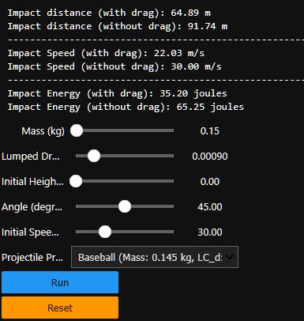
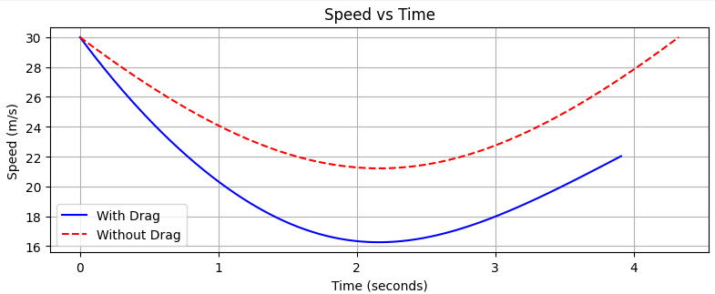
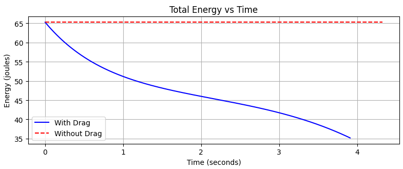

# Projectile Motion Simulator

An interactive physics simulation that models projectile motion **with and without aerodynamic drag**.  
This tool visualizes trajectories, speed, and energy in real time using adjustable parameters and presets for common objects.

---

## Overview

This simulation numerically solves the equations of motion for a projectile launched at an angle, comparing:

- **Ideal motion (no drag)**
- **Realistic motion (quadratic drag)**

The interface allows you to adjust:

- Mass  
- Drag coefficient  
- Launch angle  
- Initial height  
- Initial velocity  

You can also select from several real‑world presets (baseball, soccer ball, shotput, etc.).

---

## Try It Online

Launch the fully interactive version in your browser:
 
No installation required.

---

## Preview

### User Interface

### Trajectory Comparison (Drag vs No Drag)

### Speed vs Time

### Energy vs Time

---

## Physics Model

The simulation solves a system of four coupled ODEs representing:

- Horizontal position \( x \)  
- Vertical position \( y \)  
- Horizontal velocity \( v_x \)  
- Vertical velocity \( v_y \)

### **No‑Drag Model**

$$
\begin{aligned}
\frac{dx}{dt} &= v_x \\
\frac{dy}{dt} &= v_y \\
\frac{dv_x}{dt} &= 0 \\
\frac{dv_y}{dt} &= -g
\end{aligned}
\qquad\qquad\qquad
$$

### **Quadratic Drag Model**
Drag force:

$$
\being{aligned}
F_d = -c v^2
\end{aligned}
$$

Resulting accelerations:

$$
\begin{aligned}
\dot{v_x} = -\frac{c}{m} v v_x,\\
\dot{v_y} = -g - \frac{c}{m} v v_y \\
\end{aligned}
$$

### **Ground Impact Detection**
An event function stops integration when:

$y(t) = 0$

This allows accurate calculation of:

- Impact distance  
- Impact speed  
- Impact kinetic energy  

---

## Features

- Real‑time interactive plots  
- Drag vs no‑drag comparison  
- Speed and energy visualization  
- Adjustable physical parameters  
- Presets for real objects  
- Clean UI with sliders and output panel  
- Numerical integration using `scipy.integrate.solve_ivp`

---
